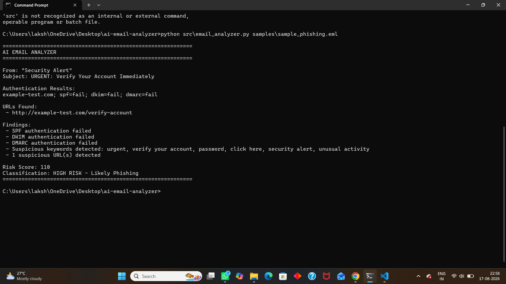
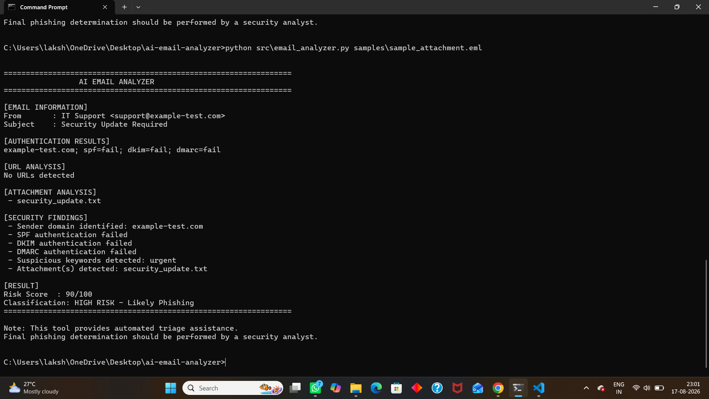
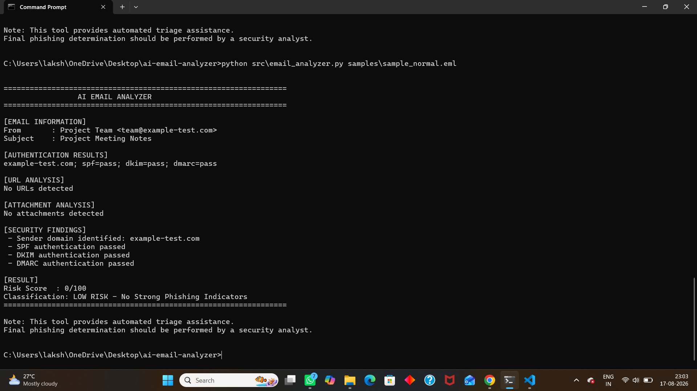

# AI Email Analyzer

A Python-based cybersecurity tool for first-level phishing email triage. The analyzer evaluates email headers, sender information, SPF/DKIM/DMARC results, suspicious keywords, URLs, and attachments to generate a phishing risk score.

## Project Overview

Phishing emails are a common social-engineering technique. Security analysts often need to quickly inspect suspicious messages and determine whether they require further investigation.

This project automates several first-level email analysis tasks and produces a risk score to help prioritize suspicious messages.

## Features

* Email header analysis
* Sender and domain analysis
* SPF authentication analysis
* DKIM authentication analysis
* DMARC authentication analysis
* Suspicious keyword detection
* URL extraction
* Suspicious URL indicators
* Attachment detection
* Risk scoring
* Phishing classification
* Command-line interface

## Technologies Used

* Python
* Email Header Analysis
* Regular Expressions
* URL Parsing
* SPF
* DKIM
* DMARC
* Cybersecurity Automation

## Project Workflow

```text
Email File (.eml)
       |
       v
Header Extraction
       |
       +------> Sender / Domain Analysis
       |
       +------> SPF / DKIM / DMARC
       |
       +------> Keyword Analysis
       |
       +------> URL Analysis
       |
       +------> Attachment Detection
       |
       v
Risk Scoring
       |
       v
Email Classification
       |
       +----> Low Risk
       |
       +----> Medium Risk
       |
       +----> High Risk
```

## Project Structure

```text
ai-email-analyzer/
│
├── README.md
├── requirements.txt
├── .gitignore
│
├── src/
│   └── email_analyzer.py
│
├── samples/
│   ├── sample_phishing.eml
│   ├── sample_attachment.eml
│   └── sample_normal.eml
│
├── screenshots/
│   ├── phishing-analysis.png
│   ├── attachment-analysis.png
│   └── normal-email-analysis.png
│
└── reports/
    └── email-analyzer-report.md
```

## Installation

Clone the repository:

```bash
git clone https://github.com/lakshaygit603/ai-email-analyzer.git
```

Navigate to the project:

```bash
cd ai-email-analyzer
```

No external Python packages are currently required because the analyzer uses Python standard-library modules.

## Usage

Analyze the synthetic phishing email:

```bash
python src/email_analyzer.py samples/sample_phishing.eml
```

Analyze the attachment test:

```bash
python src/email_analyzer.py samples/sample_attachment.eml
```

Analyze the normal email:

```bash
python src/email_analyzer.py samples/sample_normal.eml
```

## Risk Scoring

The analyzer uses an indicator-based scoring system.

| Indicator                | Maximum Contribution |
| ------------------------ | -------------------: |
| SPF failure              |                   25 |
| DKIM failure             |                   25 |
| DMARC failure            |                   25 |
| Suspicious keywords      |                   25 |
| Suspicious URLs          |                   20 |
| Attachments              |                   20 |
| Sender/domain indicators |             Variable |

### Classification

|  Score | Classification |
| -----: | -------------- |
|   0–24 | Low Risk       |
|  25–49 | Medium Risk    |
| 50–100 | High Risk      |

The scoring system is intended for demonstration and first-level triage. It does not provide a definitive determination that an email is malicious.

## Test Cases

### 1. Synthetic Phishing Email

The phishing test contains simulated indicators including:

* Urgent language
* Account verification request
* Password-related content
* SPF failure
* DKIM failure
* DMARC failure
* Suspicious URL

Expected result:

**HIGH RISK — Likely Phishing**

### 2. Attachment Test

The attachment test verifies that the analyzer can identify an attached file.

Expected result:

**Attachment detected**

### 3. Normal Email

The normal test contains:

* SPF pass
* DKIM pass
* DMARC pass
* No suspicious URL
* No attachment
* No strong phishing indicators

Expected result:

**LOW RISK — No Strong Phishing Indicators**

## Screenshots

### Phishing Analysis



### Attachment Analysis



### Normal Email Analysis



## Skills Demonstrated

* Python Programming
* Cybersecurity Automation
* Phishing Detection
* Email Header Analysis
* SPF/DKIM/DMARC Analysis
* URL Analysis
* Security Triage
* Risk Scoring
* Technical Documentation

## Future Improvements

* Machine-learning-based phishing classification
* NLP-based email classification
* Domain reputation analysis
* Threat intelligence API integration
* URL reputation checking
* Attachment hash analysis
* Malware sandbox integration
* HTML and JavaScript email analysis
* Automated security reports

## Disclaimer

All emails in this repository are synthetic test data created for educational purposes.

The project is intended for defensive cybersecurity research and first-level email triage. Automated results should be reviewed by a security analyst before making a final determination.
